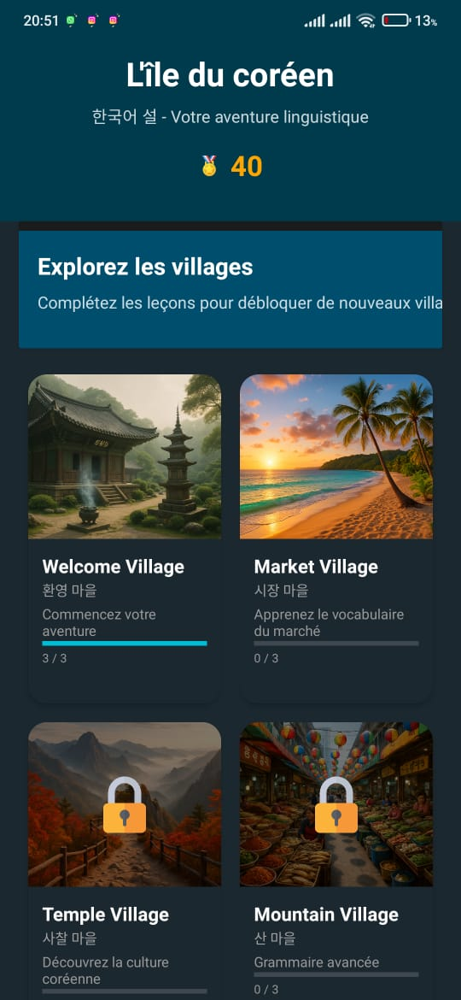
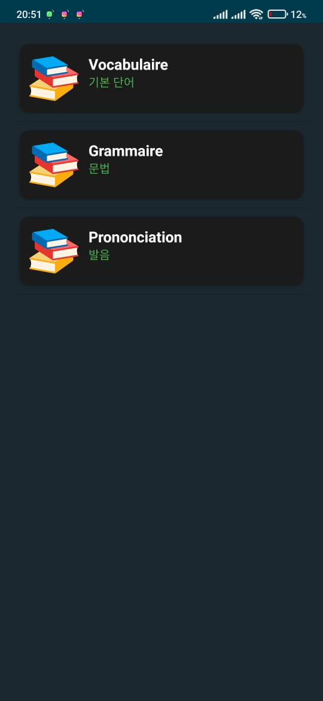
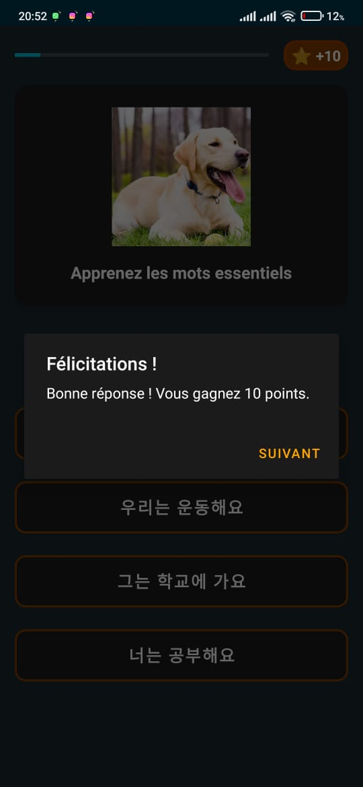
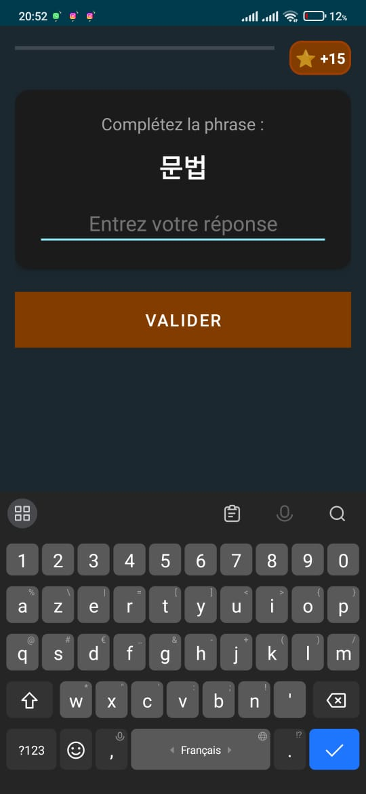
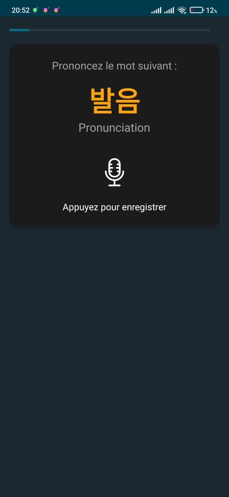

# L'île du coréen - Application d'Apprentissage du Coréen 🇰🇷

| Android | Java | Room DB | Material Design |
| :---: | :---: | :---: | :---: |
| [](https://developer.android.com/ ) | [](https://www.java.com/ ) | [](https://developer.android.com/topic/libraries/architecture/room ) | [](https://material.io/develop/android/docs/getting-started ) |

## 🌟 Description du Projet

**L'île du coréen** (한국어 설 - *Hanguk-eo Seol*) est une application mobile Android complète, conçue pour offrir une expérience d'apprentissage du coréen **ludique et gamifiée** aux utilisateurs francophones.

Le projet vise à transformer l'étude du vocabulaire, de la grammaire et de la prononciation en une aventure interactive. L'utilisateur progresse en explorant des "villages" thématiques inspirés de la culture coréenne, débloquant de nouvelles leçons et de nouveaux défis au fur et à mesure de sa maîtrise.

## ✨ Fonctionnalités Clés

L'application est structurée autour de plusieurs modules d'apprentissage et de suivi de progression :

| Catégorie | Fonctionnalité | Description |
| :--- | :--- | :--- |
| **Apprentissage** | **Villages Thématiques** | Parcours de progression structuré à travers des environnements culturels (ex: Village de bienvenue, Village du marché). |
| | **Leçons Structurées** | Modules dédiés au **Vocabulaire**, à la **Grammaire** et à la **Prononciation**. |
| | **Leçons Interactives** | Questions à choix multiples (QCM) et exercices d'association pour un renforcement actif. |
| | **Articles Culturels** | Contenu enrichi sur des sujets comme le Hangeul, l'histoire et les traditions coréennes. |
| **Évaluation** | **Quiz Évaluatifs** | Tests de fin de leçon pour valider les connaissances et obtenir des points. |
| **Gamification** | **Système de Points** | Récompense l'achèvement des leçons et la réussite des quiz. |
| | **Badges** | Système de récompenses pour les jalons de progression et l'engagement. |
| **Utilisateur** | **Profil et Progression** | Suivi des points totaux, des leçons complétées et des badges débloqués. |
| | **Notifications** | Service de notification pour encourager la pratique régulière. |

## 🛠️ Technologies Utilisées

Ce projet est une application Android native développée avec les technologies suivantes :

*   **Langage de Programmation :** Java (JDK 1.8)
*   **Plateforme :** Android (SDK 34, Min SDK 21)
*   **Base de Données :** SQLite, gérée via la librairie **Room** pour une persistance des données locale et robuste.
*   **Interface Utilisateur :** AndroidX et Composants Material Design.
*   **Outil de Build :** Gradle.

## 🏗️ Architecture du Projet

Le code suit une architecture modulaire pour une meilleure maintenabilité et évolutivité :

1.  **`activities/` :** Contient les classes d'interface utilisateur (UI) comme `MainActivity`, `QuizActivity`, `InteractiveLessonActivity`.
2.  **`models/` :** Définit les structures de données (POJOs) pour les entités de l'application (ex: `User`, `Lesson`, `QuizQuestion`, `CulturalArticle`).
3.  **`database/` :** Gère la logique de la base de données, incluant `DatabaseHelper` et les extensions pour les nouvelles tables (`DatabaseExtensions`).
4.  **`adapters/` :** Classes pour lier les données aux vues (ex: `LessonAdapter`, `VillageAdapter`).
5.  **`services/` :** Contient les services en arrière-plan, comme `ProgressNotificationService`.

## 🚀 Installation et Démarrage

Pour exécuter ce projet localement, vous aurez besoin d'Android Studio.

1.  **Cloner le dépôt :**
    ```bash
    git clone [URL_DE_VOTRE_DÉPÔT]
    cd KoreanLearningApp_Complete
    ```
2.  **Ouvrir dans Android Studio :**
    *   Lancez Android Studio et sélectionnez `File > Open`.
    *   Naviguez jusqu'au dossier `KoreanLearningApp_Complete` et ouvrez-le.
3.  **Synchronisation Gradle :**
    *   Laissez Gradle synchroniser les dépendances.
4.  **Exécuter :**
    *   Sélectionnez un émulateur ou un appareil physique.
    *   Cliquez sur le bouton **Run** (▶) pour déployer l'application.
## 📸 Aperçu (Screenshots)

<p align="center">
  
  
  
   
   
</p>
